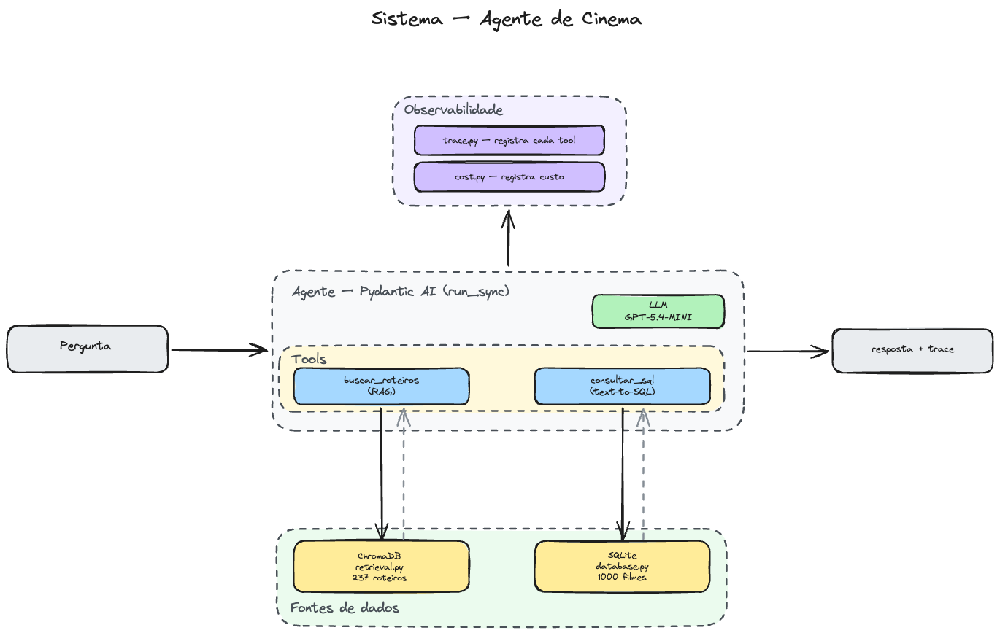
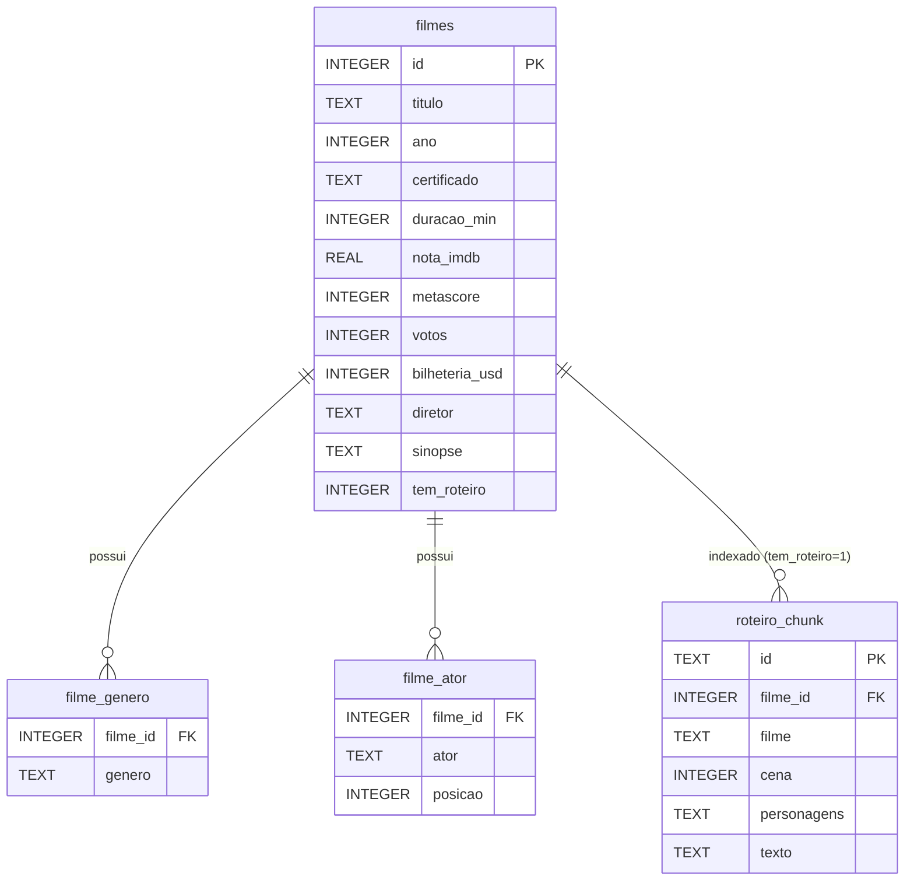

# Desafio Cinema — Scale IA

Um agente de perguntas e respostas sobre cinema, em português. Ele combina um
LLM (GPT) com ferramentas para responder perguntas sobre filmes — de fatos
nos roteiros a dados estruturados (bilheteria, diretor, ano, nota, etc.).

O agente **está entregando um desempenho abaixo do esperado.** Sua missão é
diagnosticar por que ele erra e melhorá-lo — sem trocar o modelo.

## Links

- **Dataset** (obrigatório para rodar): https://drive.google.com/drive/folders/12LXwFDHjqQnfJpevlle_u6lTsoQeSyUX
- **Formulário de submissão**: https://docs.google.com/forms/d/e/1FAIpQLScvOqNZxUQ-DZvwL6n9Kb0n2oXV4wONOCwxDMj8pyeXixl6xw/viewform

## Como o agente funciona

`agents/agente_desafio.py` define um agente (`pydantic-ai` + GPT) com um
contrato fixo:

```python
responder(pergunta: str) -> {"resposta": str, "trace": list}
```

Ferramentas que o agente pode chamar:

- `buscar_roteiros(consulta, k)` — busca semântica (RAG) nos roteiros dos
  filmes. Índice vetorial ChromaDB em `data/chroma/`, embeddings locais
  (fastembed, sem GPU nem API). Os roteiros estão em inglês.
- `consultar_sql(sql)` — executa `SELECT` no banco `data/filmes.sqlite` (dados
  estruturados dos filmes). O schema está em `docs/diagrama-er.md`.

O pipeline de recuperação vive em `utils/` (chunking, retrieval, ...). Você
pode mexer nele também — inclusive re-chunkar e reconstruir o índice.

## Arquitetura

O agente recebe a pergunta, decide quais ferramentas chamar e devolve a
resposta junto com o trace de execução:



O banco `data/filmes.sqlite` (usado pela `consultar_sql`) tem 3 tabelas — o
schema completo, com a notação e exemplos de JOIN, está em
[`docs/diagrama-er.md`](docs/diagrama-er.md):



## Setup

Requer [uv](https://docs.astral.sh/uv/).

```sh
uv sync
cp .env.example .env      # preencha OPENAI_API_KEY
```

- `OPENAI_API_KEY` (obrigatória): https://platform.openai.com/api-keys

### Dataset (obrigatório)

O índice vetorial e o banco não vêm no repositório (são grandes). Baixe a pasta
`data/` e coloque-a na raiz do projeto:

**https://drive.google.com/drive/folders/12LXwFDHjqQnfJpevlle_u6lTsoQeSyUX?usp=sharing**

Ao final você deve ter `data/chroma/`, `data/filmes.sqlite` e `data/roteiros/`
na raiz, ao lado de `agents/` e `utils/`.

## Rodando

Uma pergunta, com o trace completo (quais tools o agente chamou e o que voltou)
impresso no terminal:

```sh
uv run python agents/agente_desafio.py "Qual filme de Christopher Nolan tem a maior bilheteria?"
```

Benchmark de desenvolvimento (**com gabarito**, para você medir):

```sh
uv run python eval.py                  # completo (84 perguntas)
uv run python eval.py --split mini     # mini (28 perguntas) — itera rápido
uv run python eval.py --n 10           # só as 10 primeiras
```

O run completo são 84 chamadas sequenciais ao LLM e demora — use o
`--split mini` ou `--n` para iterar sem esperar toda vez.

O `eval.py` imprime a acurácia total e a média de chamadas de tool por pergunta
(`tools/q`), e salva o detalhe de cada resposta em `resultados/`.

## A tarefa

Melhore `agents/agente_desafio.py` (e o pipeline em `utils/`, se quiser) para
elevar a acurácia no benchmark. Diagnostique com dois sinais:

- a coluna **`tools/q`** (como o agente usa as ferramentas — buscas de menos,
  chamadas desperdiçadas, ...);
- os **traces** de perguntas individuais (o que ele buscou, o que voltou, como
  respondeu — salvos em `resultados/`).

O contrato `responder(pergunta) -> {"resposta": str, "trace": list}` **não pode
mudar** — é como o avaliador chama seu agente.

### Reconstruir o índice (opcional)

Se você mexer no chunking (`utils/chunking.py`) ou quiser reindexar:

```sh
uv run python scripts/build_index.py      # reconstrói data/chroma/ a partir de data/roteiros/
```

## Submissão

A nota final é medida num conjunto **sem gabarito**:
`benchmark/val_participante.json`. Rode seu agente sobre ele, gere as predições
e nos envie o arquivo:

```sh
uv run python scripts/gerar_predict.py    # roda seu agente sobre val_participante.json -> predict.json
```

Renomeie para `NOMEDAEQUIPE_predict.json` e envie pelo formulário:
**https://docs.google.com/forms/d/e/1FAIpQLScvOqNZxUQ-DZvwL6n9Kb0n2oXV4wONOCwxDMj8pyeXixl6xw/viewform**

Nós avaliamos contra o gabarito e comparamos as submissões. (Você desenvolve e
mede à vontade no `test.json`, que tem gabarito; o `val_participante.json` é só
para gerar a submissão.)

## Regras

Só duas:

1. **Não trocar o modelo.** Nem o LLM (`openai:gpt-5.4-mini-2026-03-17`) nem o modelo
   de embedding. Re-chunkar / reindexar com o *mesmo* modelo é permitido e
   incentivado.
2. **Não alterar o formato da saída.** O contrato
   `responder(pergunta) -> {"resposta": str, "trace": list}` precisa continuar
   idêntico — é como o avaliador lê o seu agente.

Boa sorte!
