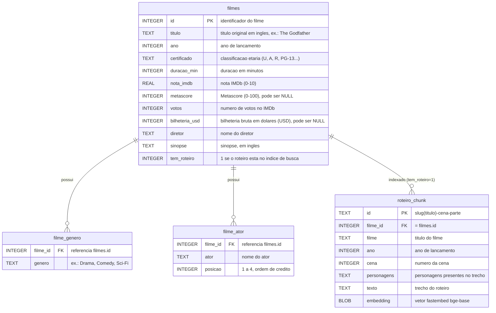

# Diagrama ER — data/filmes.sqlite

Modelo relacional do banco de filmes (IMDb Top 1000), com 3 tabelas.



## Como ler o diagrama (notação crow's-foot)

Mermaid usa a notação "pé de galinha" (crow's-foot) para relacionamentos.
Cada lado da linha tem um símbolo que indica quantas linhas daquela tabela
podem participar da relação:

- `||` = exatamente um (obrigatório)
- `o{` = zero ou muitos
- `|{` = um ou muitos

Assim, `filmes ||--o{ filme_genero` lê-se: **um** filme (`||`) está associado
a **zero ou muitos** registros de `filme_genero` (`o{`). Ou seja, é uma
relação **1 para N**: cada linha de `filme_genero`/`filme_ator` pertence a
exatamente um filme, mas um filme pode ter várias linhas nessas tabelas.

- **PK** = chave primária (identifica a linha).
- **FK** = chave estrangeira (aponta para a chave primária de outra tabela).

## Estrutura das tabelas

- **`filmes`** é a tabela central: 1 linha por filme, 1000 no total. `id` é a
  chave primária (PK).
- **`filme_genero`** guarda os gêneros de cada filme (um filme pode ter mais
  de um gênero). `filme_id` é chave estrangeira (FK) para `filmes.id`.
- **`filme_ator`** guarda o elenco principal de cada filme (até 4 atores,
  ordenados por `posicao`). `filme_id` é chave estrangeira (FK) para
  `filmes.id`.

## Exemplos de junção (JOIN)

```sql
-- generos de um filme
SELECT g.genero FROM filme_genero g
JOIN filmes f ON f.id = g.filme_id
WHERE f.titulo = 'Inception';

-- filmes em que um ator aparece
SELECT f.titulo, f.ano FROM filme_ator a
JOIN filmes f ON f.id = a.filme_id
WHERE a.ator = 'Tom Hanks'
ORDER BY f.ano;
```

> O schema canônico (usado pela tool de consulta SQL) vive em
> `utils/database.py`; este diagrama é a mesma estrutura em forma visual,
> para consulta rápida.

## A base vetorial (`roteiro_chunk`)

`roteiro_chunk` **não é uma tabela do SQLite** — é a coleção vetorial do
ChromaDB (`data/chroma/`), usada para busca semântica nos roteiros. Cada
registro é um trecho (chunk) de roteiro com seu embedding, criado por
`scripts/build_index.py`. O campo `filme_id` é a ponte entre os dois bancos:
é o mesmo `INTEGER` de `filmes.id`. Apenas os filmes com
`tem_roteiro = 1` em `filmes` têm chunks correspondentes em `roteiro_chunk`.
